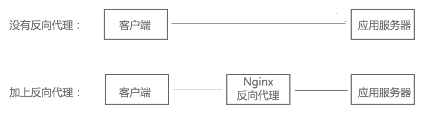
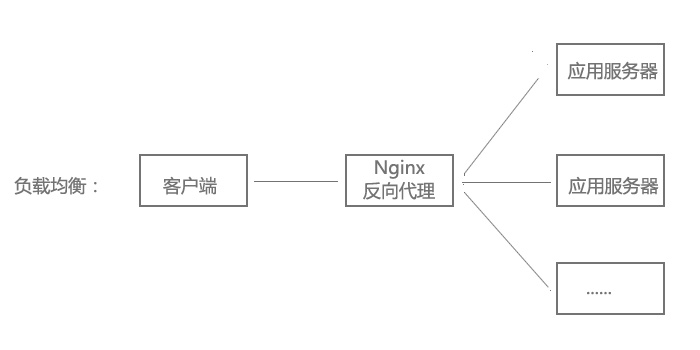

# Nginx入门

## Nginx命令
* nginx            # 启动Nginx
* nginx -s reload            # 重新载入配置文
* nginx -s reopen            # 重启 Nginx
* nginx -s stop              # 停止 Nginx
* ps -ef | grep nginx        # 查看 Nginx进程

## 静态HTTP服务器
首先，Nginx是一个HTTP服务器，可以将服务器上的静态文件（如HTML、图片）通过HTTP协议展现给客户端。

配置：

```html
server {
	listen 80; # 端口号
	location / {
		root /usr/share/nginx/html; # 静态文件路径
	}
}
```

## 反向代理服务器
什么是反向代理？

客户端本来可以直接通过HTTP协议访问某网站应用服务器，如果网站管理员在中间加上一个Nginx，客户端请求Nginx，Nginx请求应用服务器，然后将结果返回给客户端，此时Nginx就是反向代理服务器。



反向代理 配置：

```html
server {
	listen 80;
	location / {
		proxy_pass http://192.168.0.112:8080; # 应用服务器HTTP地址
	}
}
```

## 负载均衡
当网站访问量非常大，也摊上事儿了。因为网站越来越慢，一台服务器已经不够用了。于是将相同的应用部署在多台服务器上，将大量用户的请求分配给多台机器处理。同时带来的好处是，其中一台服务器万一挂了，只要还有其他服务器正常运行，就不会影响用户使用。

Nginx可以通过反向代理来实现负载均衡。



负载均衡配置：

```html
upstream myapp {
	server 192.168.0.111:8080; # 应用服务器1
	server 192.168.0.112:8080; # 应用服务器2
}
server {
	listen 80;
	location / {
		proxy_pass http://myweb;
	}
}
```

## 虚拟主机
的网站访问量大，需要负载均衡。然而并不是所有网站都如此出色，有的网站，由于访问量太小，需要节省成本，将多个网站部署在同一台服务器上。

例如将www.aaa.com和www.bbb.com两个网站部署在同一台服务器上，两个域名解析到同一个IP地址，但是用户通过两个域名却可以打开两个完全不同的网站，互相不影响，就像访问两个服务器一样，所以叫两个虚拟主机。

配置：
```html
server {
	listen 80 default_server;
	server_name _;
	return 444; # 过滤其他域名的请求，返回444状态码
}
server {
	listen 80;
	server_name www.aaa.com; # www.aaa.com域名
	location / {
		proxy_pass http://localhost:8080; # 对应端口号8080
	}
}
server {
	listen 80;
	server_name www.bbb.com; # www.bbb.com域名
	location / {
		proxy_pass http://localhost:8081; # 对应端口号8081
	}
}
```
在服务器8080和8081分别开了一个应用，客户端通过不同的域名访问，根据server_name可以反向代理到对应的应用服务器。

虚拟主机的原理是通过HTTP请求头中的Host是否匹配server_name来实现的，有兴趣的同学可以研究一下HTTP协议。

另外，server_name配置还可以过滤有人恶意将某些域名指向你的主机服务器。