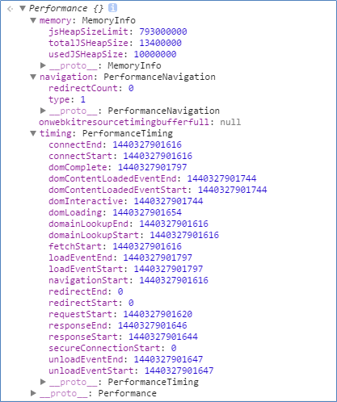

# HTML5 performancel

Performance目前支持浏览器：IE9+，Chrome11+，Firefox7+。Safari并不在列，亲测手机QQ浏览器iOS版，确实没有支持这个API。

performance 在window下的方法：window.performance，里边包含若干性能相关的数据，timing 详细记录了加载各个过程的时间点信息，对比可以分析出当前页面的打开性能数据。

