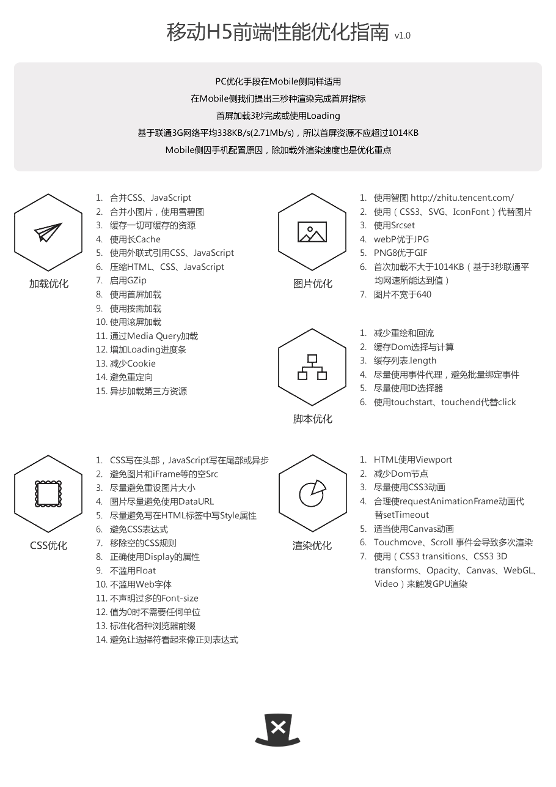

# 前端优化
 
Timing 对象里边的数据比较多，梳理如下几个关键性的节点：
* fetchStart：发起获取当前文档的时间点，我的理解是浏览器收到发起页面请求的时间点；
* domainLookupStart：返回浏览器开始DNS查询的时间，如果此请求没有DNS查询过程，如长连接、资源cache、甚至是本地资源等，那么就返回 fetchStart的值；
* domainLookupEnd：返回浏览器结束DNS查询的时间，如果没有DNS查询过程，同上；
* connectStart：浏览器向服务器请求文档，开始建立连接的时间，如果此连接是一个长连接，或者无需与服务器连接（命中缓存），则返回domainLookupEnd的值；
* connectEnd：浏览器向服务器请求文档，建立连接成功的时间；
* requestStart：开始请求文档的时间（注意没有requestEnd）;
* responseStart：浏览器开始接收第一个字节数据的时间，数据可能来自于服务器、缓存、或本地资源；
* unloadEventStart：卸载上一个文档开始的时间；
* unloadEventEnd：卸载上一个文档结束的时间；
* domLoading：浏览器把document.readyState设置为“loading”的时间点，开始构建dom树的时间点；
* responseEnd：浏览器接收最后一个字节数据的时间，或连接被关闭的时间；
* domInteractive：浏览器把document.readyState设置为“interactive”的时间点，DOM树创建结束；
* domContentLoadedEventStart：文档发生DOMContentLoaded事件的时间；
* domContentLoadedEventEnd：文档的DOMContentLoaded 事件结束的时间；
* domComplete：浏览器把document.readyState设置为“complete”的时间点；
* loadEventStart：文档触发load事件的时间；
* loadEventEnd：文档出发load事件结束后的时间

参照如上几个时间点，基本覆盖了浏览器加载一个页面的全过程。其中可以看到domloading等时间发生于responseEnd之前，也说明浏览器是边下载边构建dom树的。

如果只关注业务的首屏加载时间，只需关注loadEventEnd和fetchStart的时间差，如果还需要关注其他如dns查找时间，dom树构建时间等，直接算相应的时间差值即可，如下图：