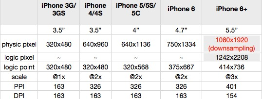
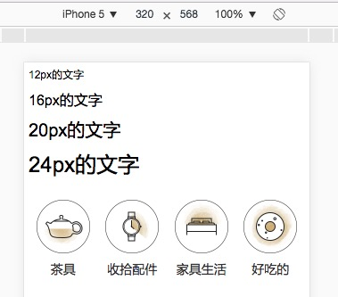
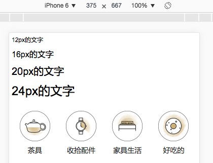
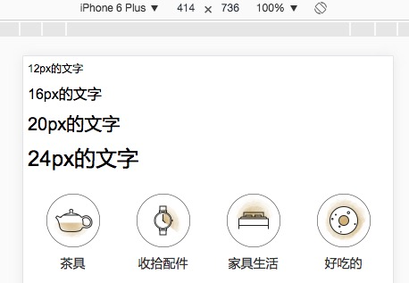
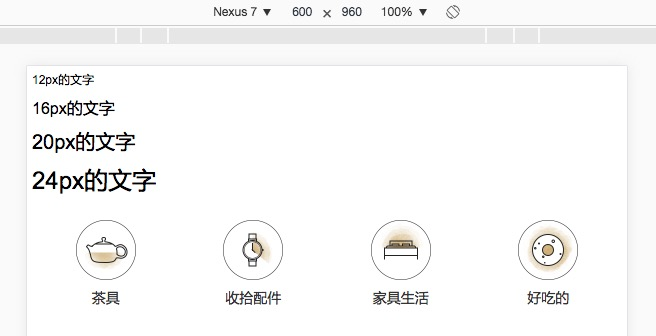
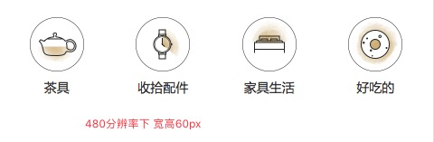
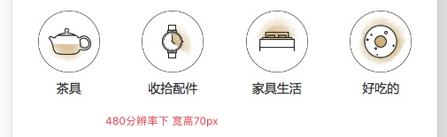
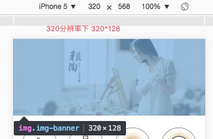
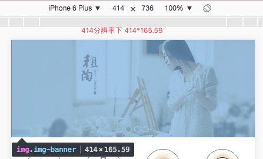
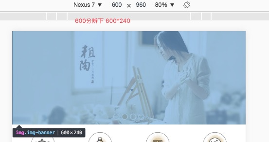

# 移动端适配方案

### 前言
要想做好移动端开发，首先要解决的是适配问题。现在的手机分辨率多达几十种，具体的的可以查看[友盟+统计](http://www.umindex.com/devices/ios_resolutions)或者
[http://viewportsizes.com](http://viewportsizes.com)。当然这里统计的都是物理像素，我们所用到的逻辑像素远没这么大。


### 物理像素和逻辑像素
俗话说物理分辨率是硬件所支持的，逻辑分辨率是软件。
我们先来看看ios客户端的尺寸分辨率表：

物理尺寸是指屏幕的实际大小。大的屏幕同时必须要配备高分辨率，也就是在这个尺寸下可以显示多少个像素，显示的像素越多，可以表现的余地自然越大。
这里的scale @1x @2x @3x指的是逻辑像素和物理像素的倍数值，当然这只是苹果的标准。
Android的标准会更多，传说中的2K、4K、5K屏的倍数会更大，有兴趣的童鞋可以去研究研究。
这就是为什么css中的1px并不等于设备的1px的原因
在移动端浏览器中以及某些桌面浏览器中，window对象有一个devicePixelRatio属性，它的官方的定义为：设备物理像素和设备独立像素的比例，也就是 devicePixelRatio = 物理像素 / 独立像素。css中的px就可以看做是设备的独立像素，所以通过devicePixelRatio，我们可以知道该设备上一个css像素代表多少个物理像素。例如，在Retina屏的iphone上，devicePixelRatio的值为2，也就是说1个css像素相当于2个物理像素。但是要注意的是，devicePixelRatio在不同的浏览器中还存在些许的兼容性问题，所以我们现在还并不能完全信赖这个东西，具体的情况可以看下[这篇文章](http://www.quirksmode.org/blog/archives/2012/06/devicepixelrati.html)。

### viewport
[ppk大神](http://www.quirksmode.org/)对于移动设备上的viewport有着非常多的研究
[第一篇](http://www.quirksmode.org/mobile/viewports.html)
[第二篇](http://www.quirksmode.org/mobile/viewports2.html)
[第三篇](http://www.quirksmode.org/mobile/metaviewport/)
有兴趣的同学可以去看一下，本文中有很多数据和观点也是出自那里。
ppk认为，移动设备上有三个viewport(layout viewport,visual viewport,ideal viewport)
这里只说ideal viewport，前俩者不讨论。
ideal viewport指的是，首先不需要用户缩放和横向滚动条就能正常的查看网站的所有内容；第二，显示的文字的大小是合适，
比如一段14px大小的文字，不会因为在一个高密度像素的屏幕里显示得太小而无法看清，理想的情况是这段14px的文字无论是
在何种密度屏幕，何种分辨率下，显示出来的大小都是差不多的。当然，不只是文字，其他元素像图片什么的也是这个道理。

```html
<meta name="viewport" content="width=device-width, initial-scale=1.0, maximum-scale=1.0, user-scalable=0">
```
写过移动端的对这个不会陌生，这个meta标签就是把viewport设置称ideal viewport，因为浏览器默认的是layout viewport。
该meta标签的作用是让当前viewport的宽度等于设备的宽度，同时不允许用户手动缩放。

在苹果的规范中，meta viewport 有6个属性(暂且把content中的那些东西称为一个个属性和值)，如下：
* width	设置layout viewport  的宽度，为一个正整数，或字符串"width-device"
* initial-scale	设置页面的初始缩放值，为一个数字，可以带小数
* minimum-scale	允许用户的最小缩放值，为一个数字，可以带小数
* maximum-scale	允许用户的最大缩放值，为一个数字，可以带小数
* height	设置layout viewport  的高度，这个属性对我们并不重要，很少使用
* user-scalable	是否允许用户进行缩放，值为"no"或"yes", no 代表不允许，yes代表允许

这些属性可以同时使用，也可以单独使用或混合使用，多个属性同时使用时用逗号隔开就行了。
此外，在安卓中还支持  target-densitydpi  这个私有属性，它表示目标设备的密度等级，作用是决定css中的1px代表多少物理像素
* target-densitydpi 	值可以为一个数值或 high-dpi 、 medium-dpi、 low-dpi、 device-dpi 这几个字符串中的一个

特别说明的是，当 target-densitydpi=device-dpi 时， css中的1px会等于物理像素中的1px。
因为这个属性只有安卓支持，并且安卓已经决定要废弃target-densitydpi  这个属性了，所以这个属性我们要避免进行使用。


### 适配方案
```html
<!DOCTYPE html>
<html lang="en">
<head>
  <meta charset="UTF-8">
  <meta name="viewport"
    content="width=device-width,initial-scale=1,user-scalable=no,minimum-scale=1,maximum-scale=1">
  <title>测试</title>
  <script type="text/javascript">
    (function (win, doc) {
      /**
       * rem 响应式解决方案
       * 基础宽度375,以 实际宽度/基础宽度 比例放缩
       */
      function setRootFontSize () {
        let docWidth = doc.documentElement.getBoundingClientRect().width;
        let scale = docWidth / 375
        doc.documentElement.style.fontSize = scale * 100 + '%'
      }
      setRootFontSize();
      win.addEventListener('resize', setRootFontSize, false);
    })(window, document)
  </script>
</head>
<body>
</body>
</html>
```

> 原理：HTML放大倍数 N=逻辑像素/基础像素
> 需要等比放缩的用rem,反之用px

#### js计算
```js
(function (win, doc) {
      /**
       * rem 响应式解决方案
       * 基础宽度375,以 实际宽度/基础宽度 比例放缩
       */
      function setRootFontSize () {
        let docWidth = doc.documentElement.getBoundingClientRect().width;
        let scale = docWidth / 375
        doc.documentElement.style.fontSize = scale * 100 + '%'
      }
      setRootFontSize();
      win.addEventListener('resize', setRootFontSize, false);
    })(window, document)
```
这里是以苹果6的逻辑像素375为基础的放缩的，当然这个值可以根据自己的需要设定，iPhone5的320也可以等。

```html
<html lang="en" style="font-size: 85.3333%;"> 在iphone5下
```

```html
<html lang="en" style="font-size: 100%;"> 在iphone6下
```

```html
<html lang="en" style="font-size: 110.4%;"> 在iphone6P下
```

```html
<html lang="en" style="font-size: 160%;"> 在Nexus7下
```

这里用的单位是px, 用px就代表不需要放缩，在任何分辨率下显示的大小都是一样的，字体和图标都是这样的。

可以看出来逻辑像素越高的情况下，像这种图标并排显示的间隔会很大，看起来不美观，因为px不会随着去放缩。
个人建议利用CSS3媒体流查询设置区间，当然这个区间相隔大点，基础像素的.5倍、1倍等(其实就是多套样式)，然后复写图标字体的样式，使之看起来更美观些。
例如：320分辨率下宽高为60px;在480分辨率下宽度为70px





移动端写页面肯定需要等比放缩的，这时候就需要用到单位rem
*  em与rem的区别
*  em:em是相对长度单位。相对于当前对象呗文本的字体尺寸如当前对行内文本的字体尺寸未被人为设置，则相对于浏览器的默认字体尺寸。
*  如果元素自身没有设置字体大小，那么元素自身上的所有属性值如“boder、width、height、padding、margin、line-height”等值，
* 们都可以按下面的公式来计算：1 ÷ 父元素的font-size × 需要转换的像素值 = em值
*  这一种千万要慢慢理解，不然很容易与第二点混了。如果元素设置了字体大小，那么字体大小的转换依旧按第二条公式计算，也就是下面的：1 ÷ 父元素的font-size × 需要转换的像素值 = em值
*  那么元素设置了字体大小，此元素的其他属性，如“border、width、height、padding、margin、line-height”计算就需要按照下面的公式来计算：1 ÷ 元素自身的font-size × 需要转换的像素值 = em值
*  rem:rem是相对于根元素<html>
*  对象设置字体大小，其他样式值不像em那样需要重新计算值。所以用rem做响应式很方便。

用rem就是让在任何分辨率的情况下，宽高比率都是一样。常用的地方就是对图片的处理，防止图片的变形

例如:375分辨率下 图片宽375px高150px 高度折算成9.375rem
```html
<html lang="en" style="font-size: 85.3333%;"> 在iphone5下
```

```html
<html lang="en" style="font-size: 100%;"> 在iphone6下
```

```html
<html lang="en" style="font-size: 110.4%;"> 在iphone6P下
```

```html
<html lang="en" style="font-size: 160%;"> 在Nexus7下
```


实际的移动端项目中是px与rem混合使用开发。其实也可以只使用rem为单位，这样的话，任何分辨率下 页面展现的比例和设计完全一样。唯一的缺点就是分辨率大的情况下，字体图标图片看起来会特别大。


#### 纯css
原理一样，只是通过css3媒体流查询来设置Html的font-size值

下面的区间值为55px
```css
  @media screen and (min-width: 320px) {html {font-size: 85.3333% !important}}
  @media screen and (min-width: 375px) {html {font-size: 100% !important}}
  @media screen and (min-width: 430px) {html {font-size: 114.6666% !important}}
  @media screen and (min-width: 485px) {html {font-size: 129.3333% !important}}
  @media screen and (min-width: 540px) {html {font-size: 144% !important}}
  @media screen and (min-width: 595px) {html {font-size: 158.6666% !important}}
  @media screen and (min-width: 650px) {html {font-size: 173.3333% !important}}
  @media screen and (min-width: 705px) {html {font-size: 188% !important}}
  @media screen and (min-width: 760px) {html {font-size: 202.6666% !important}}
  @media screen and (min-width: 815px) {html {font-size: 217.3333% !important}}
  @media screen and (min-width: 870px) {html {font-size: 232% !important}}
```
区间值可以自己设置。纯css的好处就是避免了js计算，虽然没有js计算的那么的精确。

### 总结
移动开发难就难在针对需要等比例放缩的位置把控。还有就是分辨率大的情况下，没有放缩的地方，可能会空白很多，整体布局
看起来就会很...

根据要求的设计标准选择合适的解决方案才是正解。


*[移动前端开发之viewport的深入理解](http://www.cnblogs.com/2050/p/3877280.html) *
*[www.quirksmode.org](http://www.quirksmode.org/)*


